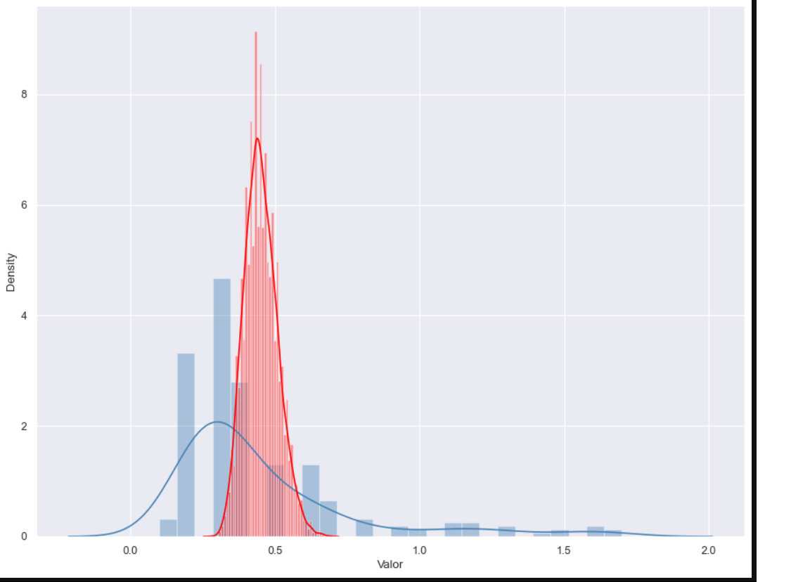
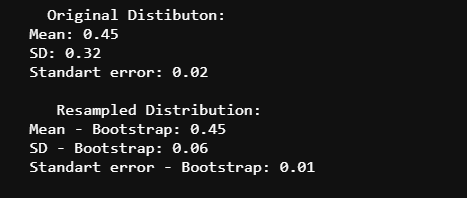

# bootstrap- econometrics
Simple bootstrap function in Python. It resample data and plot a graph with median and mean line.

## Plot original distribuition and resampled distribution

```python 
Bootstrap(serie_dados,graph=True)
```




## Return mean, standard deviation and error form original and resampled data
```python 
Bootstrap(serie_dados,stats=True)
```



## Return resampled data as a list
```python 
new_series=Bootstrap(serie_dados,serie=True)
```

